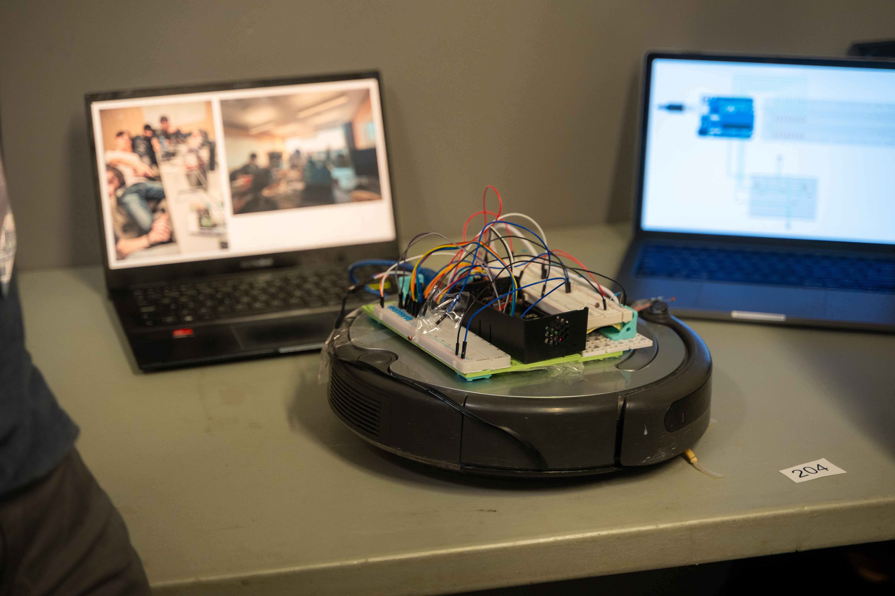
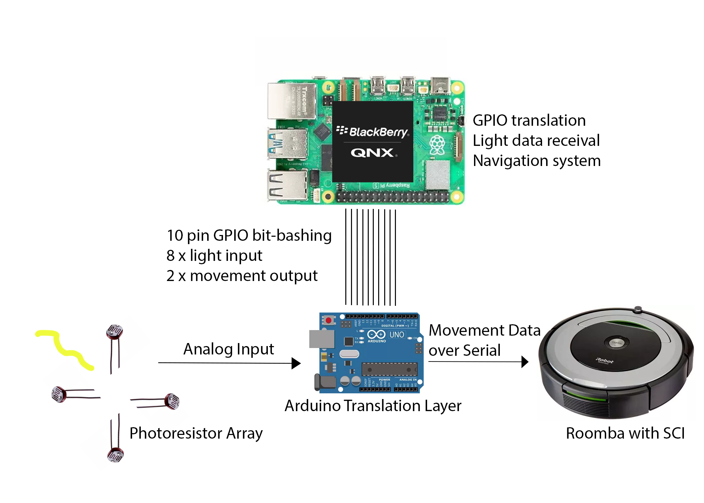
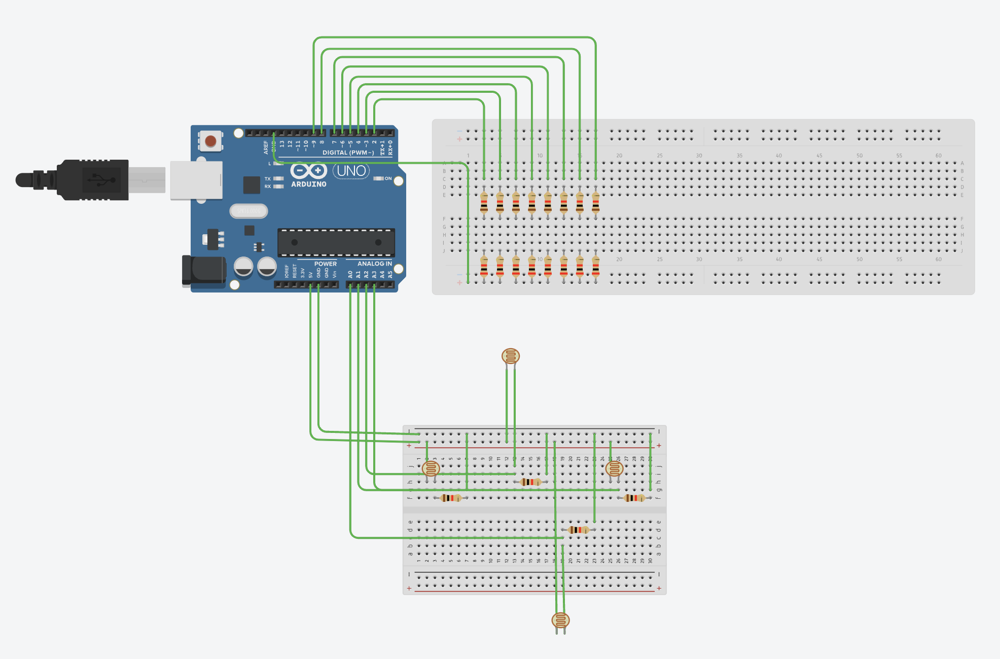

# Rambo the QNX Roomba

A Raspberry Pi 4B running QNX controls a Roomba vacuum cleaner equipped with an Arduino and four photoresistors for light-based navigation.

The idea is that we have a plant on top of a motorized base, allowing the plant to have constant access to sunlight using our 4 photoresistors to find the most amount of light. 

We use the Arduino to receive the analog sensors, then convert them to discrete values to allow for processing on the Raspberry Pi. Then, based off the 4 sensors, a Python algorithm on the Raspberry Pi calculates which direction to head towards. 

## Schematics

Can't find raspberry pi schematics on Tinkercad so idk.